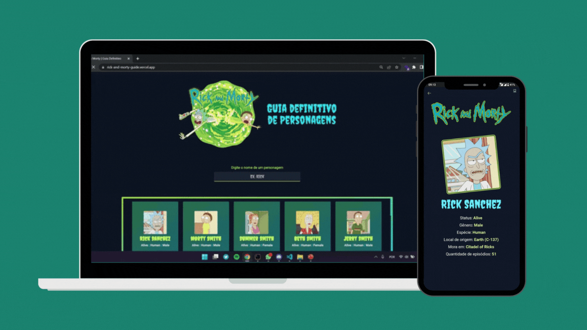

<div align="center">
<h1>Rick and Morty Characters Guide</h1>
Click <a href = "https://rick-and-morty-guide.vercel.app/">here</a> to see it live!

## Preview



## Setup

**Clone the project and access the folder**

```bash
git clone https://github.com/M0nicaVaz/rick-and-morty.git && cd rick-and-morty
```

**Follow the steps below**

```bash
# Install the dependencies
yarn or npm install

# Run the web server
npm run dev
# or
yarn dev

```

Open [http://localhost:3000](http://localhost:3000) with your browser to see the result.

## Tech Stack

Made with 💜 but also with
[Rick and Morty API](https://rickandmortyapi.com/documentation/), [Next.js](https://nextjs.org/), [React](https://reactjs.org/), [TypeScript](https://www.typescriptlang.org/) and [Tailwind](https://tailwindcss.com/).

<br> by <a href="https://www.linkedin.com/in/monica-vaz/"> Monica Vaz </a>

</div>
